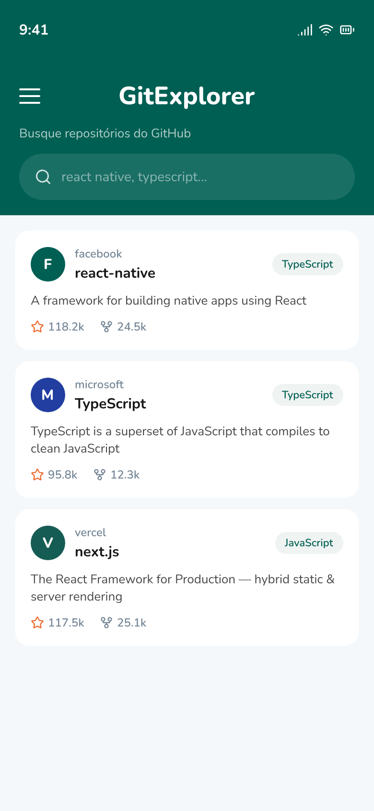
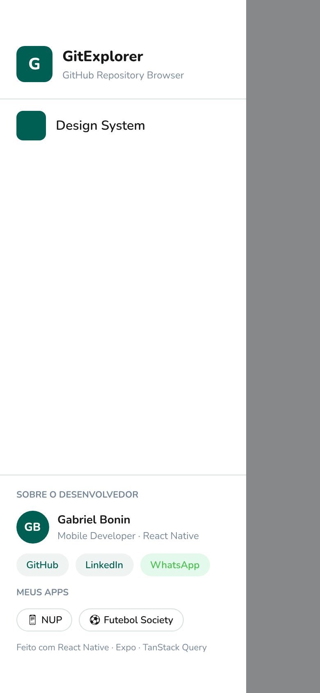
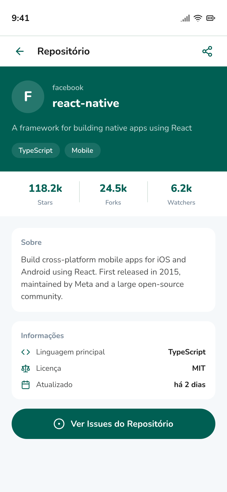
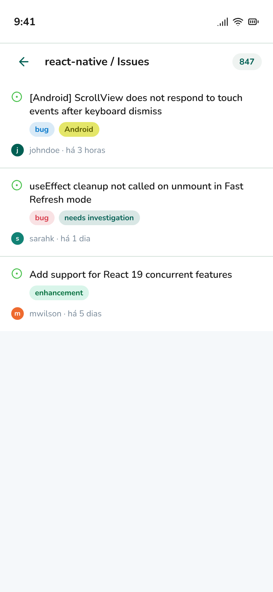
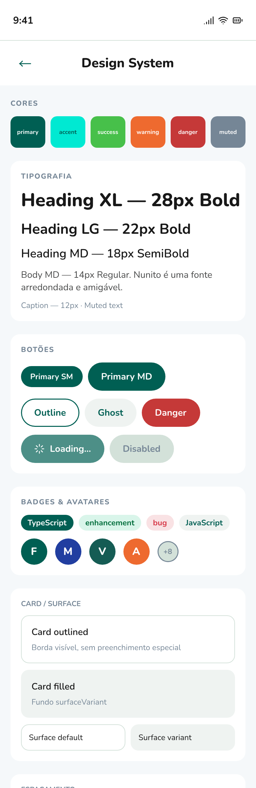

# GitExplorer — Teste Técnico Alymente

App mobile em **React Native + Expo** que integra com a API pública do GitHub, permitindo buscar repositórios, visualizar detalhes e explorar issues — com um Design System tipado e consistente baseado na identidade visual da Alymente.

---

## Índice

- [Design das telas](#design-das-telas)
- [Pré-requisitos](#pré-requisitos)
- [Clone, instalação e execução](#clone-instalação-e-execução)
- [Variáveis de ambiente (opcional)](#variáveis-de-ambiente-opcional)
- [Arquitetura](#arquitetura)
- [Design System & Tema](#design-system--tema)
- [Decisões técnicas](#decisões-técnicas)
- [Histórico de ajustes](#histórico-de-ajustes)

---

## Design das telas

Protótipos criados no **Pencil** antes da implementação, seguindo os tokens de cor e tipografia da identidade Alymente.

| Busca | Menu Lateral | Detalhes | Issues | Design System |
|:---:|:---:|:---:|:---:|:---:|
|  |  |  |  |  |

---

## Pré-requisitos

| Ferramenta | Versão mínima |
|---|---|
| Node.js | 20.x |
| npm | 10.x |
| Expo CLI | `npx expo` (sem instalação global necessária) |
| iOS Simulator | Xcode 15+ (macOS apenas) |
| Android Emulator | Android Studio Hedgehog+ |

> **Recomendado:** usar o **Expo Go** no dispositivo físico para a forma mais rápida de rodar o app.

---

## Clone, instalação e execução

### 1. Clone o repositório

```bash
git clone https://github.com/<seu-usuario>/alymente-gitexplorer.git
cd alymente-gitexplorer
```

### 2. Instale as dependências

```bash
npm install
```

### 3. Execute o app

#### Expo Go (mais rápido — sem build nativo)

```bash
npx expo start
```

Escaneie o QR code com o app **Expo Go** no seu dispositivo (iOS ou Android).

#### iOS Simulator

```bash
npx expo run:ios
```

> Requer Xcode instalado e um simulador configurado.

#### Android Emulator

```bash
npx expo run:android
```

> Requer Android Studio com um AVD (dispositivo virtual) em execução.

#### Web (referência visual apenas)

```bash
npx expo start --web
```

---

## Variáveis de ambiente (opcional)

A API pública do GitHub permite **60 requisições/hora** sem autenticação. Para aumentar o limite para **5.000 req/hora**, crie um arquivo `.env` na raiz do projeto:

```bash
cp .env.example .env
```

Preencha com seu token:

```env
EXPO_PUBLIC_GITHUB_TOKEN=ghp_seu_token_aqui
```

> **Atenção:** o arquivo `.env` já está no `.gitignore`. Nunca commite credenciais.

Para gerar um token: [github.com/settings/tokens](https://github.com/settings/tokens) — nenhum escopo necessário para repositórios públicos.

---

## Arquitetura

O projeto adota uma **arquitetura por features (módulos)**, onde cada funcionalidade é autossuficiente e contém suas próprias camadas internas. Isso facilita a escalabilidade e o isolamento de responsabilidades.

```
src/
├── app/
│   ├── modules/                        # Features da aplicação
│   │   ├── search/                     # Busca de repositórios
│   │   │   ├── screens/                # Tela principal da busca
│   │   │   ├── components/             # Componentes exclusivos da feature
│   │   │   ├── hooks/                  # useSearchRepos (TanStack Query)
│   │   │   ├── services/               # Chamadas à API do GitHub
│   │   │   ├── utils/                  # Helpers específicos da feature
│   │   │   └── types.ts                # Tipos locais (SearchParams, etc.)
│   │   ├── repository/                 # Detalhes do repositório
│   │   │   ├── screens/
│   │   │   ├── components/
│   │   │   ├── hooks/                  # useRepository
│   │   │   ├── services/
│   │   │   └── types.ts
│   │   ├── issues/                     # Lista de issues
│   │   │   ├── screens/
│   │   │   ├── components/
│   │   │   ├── hooks/                  # useIssues
│   │   │   ├── services/
│   │   │   └── types.ts
│   │   └── showcase/                   # Vitrine do Design System
│   │       └── screens/
│   ├── routes/                         # Navegação centralizada (React Navigation)
│   │   └── index.tsx
│   └── assets/                         # Imagens e ícones estáticos
│
├── design-system/
│   ├── tokens/                         # Tokens tipados e imutáveis
│   │   ├── colors.ts                   # lightColors / darkColors
│   │   ├── spacing.ts                  # xs=4, sm=8, md=16, lg=24, xl=32
│   │   ├── radius.ts                   # sm=6, md=12, lg=20, full=9999
│   │   ├── typography.ts               # Nunito + escala de tamanhos
│   │   └── index.ts
│   ├── components/                     # Componentes base tipados
│   │   ├── Text/
│   │   ├── Button/
│   │   ├── Input/
│   │   ├── Card/
│   │   ├── Badge/
│   │   └── Avatar/
│   └── theme/
│       ├── ThemeProvider.tsx           # Context + toggleTheme
│       ├── types.ts                    # Theme, ThemeMode
│       └── index.ts
│
└── shared/
    ├── components/                     # EmptyState, ErrorMessage, Loading
    ├── hooks/                          # useDebounce, usePrevious, etc.
    └── types/
        └── github.ts                  # Tipos da API (GithubRepository, GithubIssue…)
```

### Fluxo de dados

```
Tela (Screen)
  └── Hook (useSearchRepos / useRepository / useIssues)
        └── Service (GitHub API client)
              └── TanStack Query (cache + estado de loading/error)
```

### Navegação

React Navigation com `createNativeStackNavigator`. Pilha de rotas:

```
RootStack
  ├── Search        → Busca de repositórios (entrada)
  ├── Repository    → Detalhes (recebe { owner, repo })
  ├── Issues        → Lista de issues (recebe { owner, repo })
  └── DSShowcase    → Vitrine do Design System
```

---

## Design System & Tema

### Tokens de cores

Inspirados na identidade visual de [alymente.com.br](https://alymente.com.br/), extraídos diretamente do CSS do site (130+ usos confirmados).

| Token | Light | Dark |
|---|---|---|
| `primary` | `#005f53` | `#35e8d3` |
| `background` | `#f5f8fa` | `#0a1a18` |
| `surface` | `#ffffff` | `#132b28` |
| `text` | `#181818` | `#f0f5f4` |
| `muted` | `#758696` | `#6b8a85` |
| `border` | `#d3e1d9` | `#1f3a36` |
| `success` | `#47c04a` | `#47c04a` |
| `warning` | `#ee6a2f` | `#ee6a2f` |
| `danger` | `#c53938` | `#ff8086` |

### Tokens de espaçamento

| Token | Valor |
|---|---|
| `xs` | 4 |
| `sm` | 8 |
| `md` | 16 |
| `lg` | 24 |
| `xl` | 32 |

### Tipografia

Fonte: **Nunito** (Google Fonts) — arredondada e amigável, alinhada ao tom da Alymente.

### Componentes base

| Componente | Variantes |
|---|---|
| `Text` / `Heading` | `variant`: heading/body/caption · `size`: xs→xl |
| `Button` | `variant`: primary/outline/ghost · `size`: sm/md/lg · estados: loading, disabled |
| `Input` | `label`, `value`, `error`, `helperText` |
| `Card` / `Surface` | padrão e com imagem |
| `Badge` / `Tag` | tone: primary/success/warning/danger/neutral |
| `Avatar` | com inicial ou imagem |

> Todos os componentes são **totalmente tipados** — nenhum aceita `style` livre. Personalização acontece via props controladas (`variant`, `size`, `tone`).

---

## Decisões técnicas

### Cache e data fetching — TanStack Query (React Query)

Escolhido por oferecer cache automático, revalidação em foco, infinite scroll nativo (`useInfiniteQuery`), tratamento de erros padronizado e suporte a `staleTime` / `cacheTime` configuráveis. A alternativa SWR foi descartada por ter suporte mais limitado a paginação infinita.

### Navegação — React Navigation

Padrão da comunidade React Native, com suporte nativo a gestos, animações e deep linking. A stack nativa (`createNativeStackNavigator`) oferece performance superior à stack JS.

### Organização — Feature-based

Cada módulo (search, repository, issues) agrupa suas próprias telas, hooks e serviços. Isso evita o acoplamento entre features e facilita testes isolados.

### TypeScript estrito

`tsconfig.json` com `strict: true`. Nenhum `any` explícito — todo dado da API é tipado via interfaces (`Repository`, `Issue`, `Owner`).

### Tratamento de erros da API

- **Rate limit** (403/429): mensagem amigável com contador de tempo para reset.
- **Sem resultados** (200 com lista vazia): estado de empty state dedicado.
- **Falha de rede**: retry automático via TanStack Query (3 tentativas com backoff exponencial).

---

## Histórico de ajustes

### [Planejamento] Design no Pencil
- Definição dos tokens de cor a partir do CSS de `alymente.com.br` (130+ usos de `#005f53` confirmados)
- Criação de 4 telas no Pencil com MCP: Busca, Detalhes, Issues, Design System Showcase
- Paleta light extraída do site; paleta dark criada por contraste
- Fonte **Nunito** aplicada em toda a interface

### [Setup] Estrutura inicial do projeto
- Expo ~54 + React Native 0.81.5 + TypeScript strict
- React Navigation com `createNativeStackNavigator`
- Alias de importação `@/` configurado via `tsconfig.json`

### [Setup] Splash Screen + Fonte Nunito
- Instalado `@expo-google-fonts/nunito` — variantes: 400Regular, 600SemiBold, 700Bold, 800ExtraBold
- `SplashScreen.preventAutoHideAsync()` mantém a splash até as fontes carregarem
- `SplashScreen.hideAsync()` chamado dentro de `useEffect` após `fontsLoaded === true`
- `app.json` configurado com `splash.png`, `resizeMode: contain` e `backgroundColor: #005f53`
- Plugin `expo-splash-screen` com `image`, `resizeMode`, `backgroundColor` e `imageWidth` (sem omitir `image` — caso contrário o prebuild não gera o logo nativo)
- `SafeAreaProvider` movido para dentro de `ThemeProvider` (ordem correta de providers)

